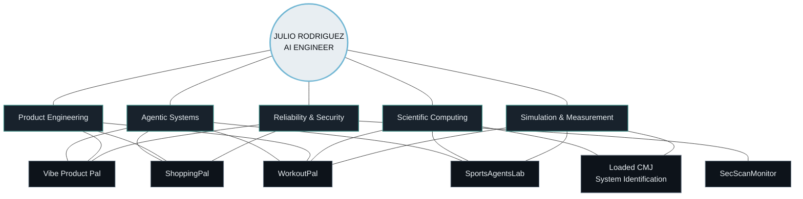

<p align="center">
  
</p>

<p align="center">
  <strong>AI Engineer building agentic products, scientific software, and production systems.</strong>
  <br/>
  I design AI with useful agency, explicit authority boundaries, deterministic computation where it matters, and quality that can be tested.
</p>

<p align="center">
  <code>Python</code> ·
  <code>TypeScript</code> ·
  <code>LangGraph</code> ·
  <code>FastAPI</code> ·
  <code>Next.js</code> ·
  <code>PostgreSQL</code> ·
  <code>Docker</code> ·
  <code>MuJoCo</code>
</p>

---

## System topology



<p align="center">
  <sub>Six flagship systems. Different domains. One engineering thesis: AI should increase capability without erasing software, scientific, or operational authority.</sub>
</p>

---

## Six flagship systems

<table>
<tr>
<td width="50%" valign="top">

### 01 · [Vibe Product Pal](https://github.com/Litju/Vibe-Product-Pal)

**Agentic product-engineering platform**

From product brief → architecture → UX/UI → prototype → testing → export, with proposal-first agent actions and explicit user approval.

**Engineering signal**<br />
`bounded agent authority` · `web/desktop parity` · `sandboxing` · `typed state`

</td>
<td width="50%" valign="top">

### 02 · [ShoppingPal](https://github.com/Litju/ShoppingPal)

**Agent-assisted commerce platform**

A real storefront where a typed shopping agent can discover, compare, and propose cart actions while Medusa remains canonical authority for products, pricing, inventory, carts, checkout, and orders.

**Engineering signal**<br />
`LangGraph` · `Medusa` · `FastAPI` · `Typesense` · `transactional boundaries`

</td>
</tr>

<tr>
<td width="50%" valign="top">

### 03 · [WorkoutPal](https://github.com/Litju/WorkoutPal-Public)

**Science-driven training software**

Agent orchestration, structured training-domain models, PostgreSQL persistence, and deterministic Python scientific processors in one product system.

**Engineering signal**<br />
`agents + numerical computing` · `domain modeling` · `auth/tenancy` · `scientific contracts`

</td>
<td width="50%" valign="top">

### 04 · [SecScanMonitor](https://github.com/Litju/Sec-Scan-Monitor)

**Evidence-first security platform for AI systems**

Evidence → observation → claim → adjudication → finding → report. Agents can assist; they do not self-authorize authoritative findings.

**Engineering signal**<br />
`FastAPI` · `OPA` · `Temporal` · `evidence provenance` · `security boundaries`

</td>
</tr>

<tr>
<td width="50%" valign="top">

### 05 · [Loaded CMJ System Identification](https://github.com/Litju/loaded-cmj-system-identification)

**Reproducible biomechanics research software**

Mechanics-first system identification of a modeled loaded countermovement jump using MuJoCo, bilateral force-platform signals, and bar/LPT kinematics.

**Engineering signal**<br />
`MuJoCo` · `optimization` · `measurement models` · `validation` · `reproducibility`

</td>
<td width="50%" valign="top">

### 06 · [SportsAgentsLab](https://github.com/Litju/SportsAgentsLab-Public)

**Multi-agent sports-science platform**

Measurement, research, monitoring, prescription, and practitioner workflows with deterministic scientific computation kept distinct from AI-assisted reasoning.

**Engineering signal**<br />
`multi-agent architecture` · `measurement` · `provenance` · `scientific authority`

</td>
</tr>
</table>

---

## How I build

```text
problem
  ↓
domain model
  ↓
authority boundaries
  ↓
deterministic core
  ↓
typed interfaces + tools
  ↓
agent orchestration
  ↓
bounded actions
  ↓
canonical validation
  ↓
tests + evaluation + observability
  ↓
production
```

I do not treat an LLM as the architecture.

The model can reason, plan, retrieve, and operate tools. The surrounding system still owns state, permissions, invariants, scientific computation, transactional truth, provenance, and failure behavior.

---

## Engineering signature

| Area | What I optimize for |
| --- | --- |
| **Agent systems** | explicit state, typed tools, bounded authority, approvals, retrieval, evaluation |
| **Scientific software** | measurand clarity, units, uncertainty, reproducibility, validation, provenance |
| **Backend / platform** | contracts, persistence, auth, queues, APIs, idempotency, graceful degradation |
| **Quality** | deterministic tests, local pre-push gates, CI/CD, clean-clone qualification, security checks |
| **Product delivery** | usable interfaces, failure-aware UX, deployment, observability, operational handoff |

---

## Technical range

**Languages**<br />
`Python` `TypeScript / JavaScript` `SQL` `Java` `R` `Bash / PowerShell` `C#`

**AI / ML**<br />
`LangGraph` `LangChain` `RAG` `tool use` `evaluation` `PyTorch` `scikit-learn` `XGBoost`

**Backend / Data**<br />
`FastAPI` `PostgreSQL` `Neon` `Redis` `Typesense` `Medusa` `Kafka` `Airflow`

**Product / Infra**<br />
`Next.js` `React` `Electron` `Docker` `GitHub Actions` `Vercel` `AWS / GCP / Azure`

**Scientific / Simulation**<br />
`NumPy` `SciPy` `Statsmodels` `MuJoCo` `signal processing` `optimization` `measurement systems`

---

## Why the science shows up everywhere

My background started in **strength & conditioning and performance analysis** before I moved into software, data, and AI.

That background permanently changed how I engineer systems: a metric needs a definition, a model needs a scope, a result needs provenance, uncertainty should not be hidden, and a plausible output is not automatically a defensible one.

That mindset now carries into agent systems, security, commerce, simulation, ML infrastructure, and production software.

---

## What I can own

- **0 → 1 agentic products**
- **AI / agent platform architecture**
- **full-stack AI systems**
- **scientific and ML software**
- **backend / data / workflow infrastructure**
- **reliability, evaluation, and production qualification**

<p align="center">
  <strong>If you're hiring for technically ambitious AI/software work, start with the six repositories above.</strong>
  <br/>
  <sub>The code, architecture, tests, and scientific boundaries are the evidence.</sub>
</p>

<p align="center">
  <a href="https://github.com/Litju/My-Curriculum-Vitae"><strong>Résumé</strong></a>
  &nbsp;·&nbsp;
  <a href="https://github.com/Litju?tab=repositories"><strong>All repositories</strong></a>
</p>
